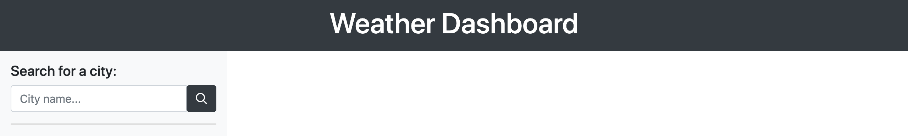
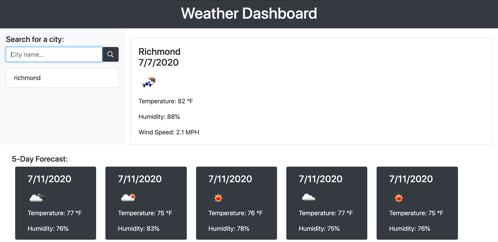

# Weather-Dashboard-Application

# Weather-Dashboard

This application is a weather dashboard with a user input functionality that can find current weather conditions and also the five day weather forecast of any city that you search.

<h3>Purpose</h3>

The purpose of this homework assignment was to build my first functional application using an API, retrieving information from that API, and using it in the context of a weather dashboard.

<h3>Functionality</h3>

The main functionality behind this application lies within the getCurrentWeather and getForecast functions. The getCurrentWeather function takes in the city, date, temperature, humidity and wind speed and appends it to the currentCity div. The getForecast function takes in the city, date, temperature, humidity and wind speed and appends it to the forecast div as 5 seperate cards. The function accesses the API and for every data point with 12:00:00 as the time stamp it then appends the weather data from that object. The data is appended and when the user searches again, the data that is currently on the page is emptied and the new city's data is then appended.

<h3>Technologies Used</h3>
<ul>
    <li>HTML</li>
    <li>CSS</li>
    <li>JavaScript</li>
    <li>Openweather API</li>
</ul>
